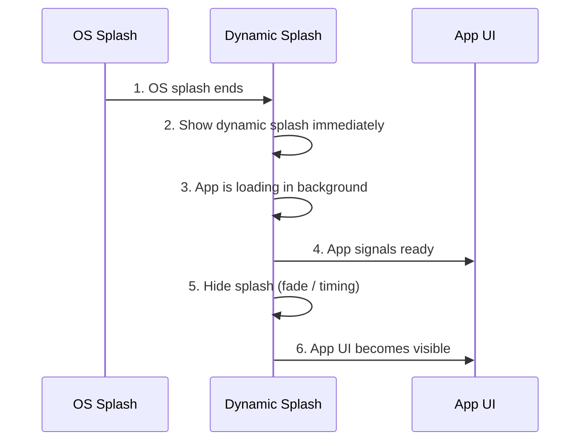

# 💐 React Native Dynamic Splash

[](https://github.com/parrotnavy/react-native-dynamic-splash/blob/main/LICENSE)
[](https://www.android.com)
[](https://developer.apple.com/ios)

<p>
  
</p>

<br>

A native-first dynamic splash layer for React Native that intentionally occupies the moment between OS launch and app readiness.

## Overview

**react-native-dynamic-splash** is not a generic full-screen banner or in-app advertisement component.

Its purpose is to provide a **dynamic, full-screen transition layer that appears immediately after the OS-level splash screen and before any app UI is rendered**.

This library intentionally targets the narrow but critical time window between:
1. The operating system’s mandatory static splash screen, and
2. The moment when the React Native application becomes interactive.

### What This Is

- A **dynamic splash / initial transition screen**
- Displayed **before app content**, not on top of it
- Controlled natively (iOS / Android), independent of JS readiness
- Capable of acting as:
  - A loading screen
  - A branded entry experience
  - A marketing / campaign surface

From a UX perspective, users perceive this as part of the app startup sequence — not as an interruptive ad.

### What This Is NOT

- ❌ A modal or screen rendered inside React Navigation
- ❌ A post-launch in-app advertisement
- ❌ A generic full-screen banner component
- ❌ A replacement for OS-level LaunchScreen assets


### Execution Model


The startup timeline is intentionally structured as:




1. **OS Static Splash**
   - Android launch theme
   - iOS `LaunchScreen.storyboard`
2. **Dynamic Splash (this library)**
   - Shown immediately after OS splash
   - Uses cached, pre-validated assets
   - Can be animated (GIF / APNG)
   - Enforced timing via native code
3. **App UI**
   - Hidden until JS signals readiness

This makes the dynamic splash a **first-class startup layer**, not an application screen.

### Architectural Principles

- **Native-first display**
  - Overlay window is fully managed by native modules
- **JS for data, not rendering**
  - JavaScript only fetches configs, downloads assets, and persists metadata
- **Next-launch determinism**
  - Assets are prepared ahead of time and only shown on the next app launch
- **Fail-closed behavior**
  - Any validation or IO failure results in no splash being shown
- **No coupling to navigation or app state**
  - The splash lifecycle is independent from React rendering

### Typical Use Cases

- Startup branding without rebuilding the app
- Campaign or promotion display at app launch
- Masking cold-start latency with intentional visuals
- Gradual replacement of static splash experiences

In short:

> **This library exists to intentionally design the moment between “app launched” and “app ready”.**

## Installation

```bash
npm install react-native-dynamic-splash
# or
yarn add react-native-dynamic-splash
```

## Native Integration

Show the READY splash content natively (based on stored metadata), then hide it once JS is ready.
**This does not touch or reuse LaunchScreen assets.**

### iOS (AppDelegate.swift)

```swift
import react_native_dynamic_splash // <-- Add like this

@main
class AppDelegate: RCTAppDelegate {
  override func application(
    _ application: UIApplication,
    didFinishLaunchingWithOptions launchOptions: [UIApplication.LaunchOptionsKey: Any]?
  ) -> Bool {
    DynamicSplashNative.show() // <-- Add like this
    return super.application(application, didFinishLaunchingWithOptions: launchOptions)
  }
}
```

### Android (MainActivity)

```java
import com.reactnativedynamicsplash.DynamicSplashNativeModule; // <-- Add like this

@Override
protected void onCreate(Bundle savedInstanceState) {
  super.onCreate(savedInstanceState);
  DynamicSplashNativeModule.show(this); // <-- Add like this
}
```

Optional storage key override (use only if you changed `storageKey` in JS):

```swift
DynamicSplashNative.setStorageKey("MY_CUSTOM_KEY")
DynamicSplashNative.show()
```

```java
DynamicSplashNativeModule.setStorageKey("MY_CUSTOM_KEY");
DynamicSplashNativeModule.show(this);
```

Then, once JS is ready, you can hide the splash:

```js
import { DynamicSplash } from "react-native-dynamic-splash";

// Hide the splash (respects minDurationMs and fade settings)
DynamicSplash.hide();

// Check if splash is currently visible
const isVisible = await DynamicSplash.isVisible();
```

Peer dependencies:

```bash
npm install react-native-dynamic-splash react-native-fs && npx pod-install
# or
yarn add react-native-dynamic-splash react-native-fs && npx pod-install
```

## Quick Start

```tsx
import React, { useEffect, useMemo } from "react";
import { createDynamicSplash, DynamicSplash } from "react-native-dynamic-splash";

const AppRoot = () => {
  const manager = useMemo(
    () =>
      createDynamicSplash({
        configProvider: async () => ({
          imageName: "promo-pink",
          alt: "Pink Hug",
          startAt: "2023-01-01T00:00:00Z",
          endAt: "2026-12-31T23:59:59Z",
          imageUrl: "https://example.com/promo-pink.png",
          configVersion: "promo-pink-v1",
          backgroundColor: "#FFC0CB",
          weight: 5,
        }),
        minDurationMs: 2000,      // Minimum display time
        maxDurationMs: 5000,      // Auto-hide after 5 seconds
        enableFade: true,         // Enable fade out animation
        fadeDurationMs: 500,      // 500ms fade duration
      }),
    [],
  );

  useEffect(() => {
    // Trigger background update to download and cache images
    manager.mount();
  }, [manager]);

  useEffect(() => {
    // Optional: Hide splash after app is ready
    const timer = setTimeout(() => {
      DynamicSplash.hide();
    }, 3000);
    return () => clearTimeout(timer);
  }, []);

  return (
    <>
      {/* App content */}
    </>
  );
};
```

## Configuration

### InitOptions

```ts
type InitOptions = {
	/** Provides splash config objects from any source (required). */
	configProvider: () => Promise<SplashConfig | SplashConfig[]>;
	/** Minimum time to keep splash visible (ms). Applied by native modules. Default: no minimum. */
	minDurationMs?: number;
	/** Maximum time to keep splash visible (ms). Native auto-hides after this duration. Default: no maximum. */
	maxDurationMs?: number;
	/** Enable fade out animation when hiding (default: true). */
	enableFade?: boolean;
	/** Fade out animation duration in milliseconds (default: 200). */
	fadeDurationMs?: number;
	/** Storage key for persisted metadata (default: "DYNAMIC_SPLASH_META_V1"). */
	storageKey?: string;
	/**
	 * Storage location for cached images.
	 * - "document": Persists across app restarts; better for long-lived assets.
	 * - "cache": Uses OS-managed cache; may be evicted by the system.
	 * Default: "document".
	 */
	fileLocation?: "document" | "cache";
	/** Optional config processed immediately on mount (pre-seeding, default: none). */
	initialConfig?: SplashConfig | SplashConfig[];
	/** Optional logging hook (default: none). */
	logger?: (msg: string, ...args: any[]) => void;
	/** Wait timeout for storage readiness before skipping dynamic splash (ms, default: 0). */
	storageReadyTimeoutMs?: number;
	/** If true, show the splash immediately after a successful update in the same session (default: false). */
	showOnUpdate?: boolean;
};
```

## JSON Contract

Required properties are minimal and focused on determinism and caching.

```ts
type SplashConfig = {
  /** Image identifier used as the cache key and file name. */
	imageName: string;
	/** Accessibility description for the image. */
	alt: string;
	/** Start time (ISO-8601). Splash is eligible only if now >= startAt. */
	startAt: string;
	/** End time (ISO-8601). Splash is eligible only if now <= endAt. */
	endAt: string;
	/** Download URL (http/https). Used to fetch the remote asset. */
	imageUrl: string;
	/** Per-image config version. If changed, cached image is invalidated. */
	configVersion: string;
	/** Background color shown behind the image if it does not fill the screen (default: none). */
	backgroundColor?: string;
	/** Relative weight (>= 0). Higher values increase selection probability (default: 1). */
	weight?: number;
};
```

Example (array is supported; weight is a ratio):

```json
[
  {
    "imageName": "promo-pink",
    "alt": "Pink Hug",
    "startAt": "2023-01-01T00:00:00Z",
    "endAt": "2026-12-31T23:59:59Z",
    "imageUrl": "https://example.com/promo-pink.png",
    "configVersion": "promo-pink-v1",
    "backgroundColor": "#FFC0CB",
    "weight": 5
  },
  {
    "imageName": "promo-blue",
    "alt": "Blue Theme",
    "startAt": "2023-01-01T00:00:00Z",
    "endAt": "2026-12-31T23:59:59Z",
    "imageUrl": "https://example.com/promo-blue.png",
    "configVersion": "promo-blue-v3",
    "backgroundColor": "#ADD8E6",
    "weight": 3
  }
]
```

## Config Provider

Provide config objects from any source (HTTP endpoint, Firebase Remote Config, feature flags, etc.):

```ts
// From HTTP endpoint
createDynamicSplash({
  configProvider: async () => {
    const response = await fetch('https://api.example.com/splash.json');
    return response.json();
  },
});

// From Firebase Remote Config
createDynamicSplash({
  configProvider: async () => {
    await remoteConfig().fetchAndActivate();
    const config = remoteConfig().getString('splash_config');
    return JSON.parse(config);
  },
});

// Static config
createDynamicSplash({
  configProvider: async () => ({
    imageName: "promo-pink",
    alt: "Pink Hug",
    startAt: "2023-01-01T00:00:00Z",
    endAt: "2026-12-31T23:59:59Z",
    imageUrl: "https://example.com/promo-pink.png",
    configVersion: "promo-pink-v1",
    backgroundColor: "#FFC0CB",
    weight: 5,
  }),
});
```

## Update Rules (Practical)

- JSON is fetched on each launch (`mount()`).
- A cached asset is reused when:
  - `status === "READY"`
  - `imageName` matches
  - `configVersion` matches
  - local file exists
- Any failure results in `ERROR` and no display on next launch.

## Architecture

### Native Layer (iOS/Android)

**Responsibilities:**
- Display/hide overlay window
- Read stored metadata from native storage
- Apply `minDurationMs` and `maxDurationMs` timing constraints
- Handle fade animations (based on `enableFade` and `fadeDurationMs`)
- Support animated images (GIF/APNG)
- Manage overlay lifecycle independently of JavaScript

**iOS Implementation:**
- Uses `UIWindow` with `UIImageView` for overlay
- `ImageIO` framework for GIF/APNG frame extraction
- `UIView.animate` for fade effects
- Timer-based auto-hide for `maxDurationMs`

**Android Implementation:**
- Uses `Dialog` with `AnimatedImageView` for overlay
- `AnimatedImageDrawable` (API 28+) for GIF/APNG support
- `View.animate()` for fade effects
- Handler-based auto-hide for `maxDurationMs`

### JavaScript Layer

**Responsibilities:**
- Fetch splash configuration from remote source
- Download and cache images
- Store metadata in native storage
- Provide API to hide overlay (`DynamicSplash.hide()`)
- Check overlay visibility (`DynamicSplash.isVisible()`)

**NOT Responsible For:**
- Displaying the overlay (native handles this)
- Managing display state (native handles this)
- Timing constraints (native handles this)

## API

### createDynamicSplash(options: InitOptions)

Creates a manager instance for background updates.

```ts
const manager = createDynamicSplash({
  configProvider: async () => ({ /* config */ }),
  minDurationMs: 2000,
  maxDurationMs: 5000,
  enableFade: true,
  fadeDurationMs: 500,
});
```

### manager.mount()

Triggers background update to fetch and cache splash images. Call this once when your app starts.

```ts
useEffect(() => {
  manager.mount();
}, [manager]);
```

### DynamicSplash.hide()

Requests native module to hide the splash overlay. Respects `minDurationMs` and applies fade animation if enabled.

```ts
DynamicSplash.hide();
```

### DynamicSplash.isVisible()

Returns current visibility state from native module.

```ts
const isVisible = await DynamicSplash.isVisible();
console.log('Splash visible:', isVisible);
```

## Animated Images

### Supported Formats

- **GIF**: Fully supported on iOS (all versions) and Android (API 28+)
- **APNG**: Fully supported on iOS (all versions) and Android (API 28+)
- **Static images**: PNG, JPEG (all platforms)

### Fallback Behavior

- **Android < API 28**: Animated images display as static (first frame only)
- **iOS**: All formats fully supported via `ImageIO` framework

### Usage

Simply provide a GIF or APNG URL in your config:

```json
{
  "imageName": "animated-promo",
  "imageUrl": "https://example.com/promo.gif",
  "configVersion": "v1"
}
```

The native modules automatically detect and animate the image.

## Fade Effects

Fade effects are configured globally in `InitOptions` (not per-splash-item):

```ts
createDynamicSplash({
  configProvider: async () => ({ /* ... */ }),
  enableFade: true,        // Enable fade out animation
  fadeDurationMs: 500,     // 500ms fade duration
});
```

- `enableFade: true` - Smooth fade out when hiding
- `enableFade: false` - Instant hide (no animation)
- `fadeDurationMs` - Duration in milliseconds (default: 200)

Fade settings are stored in metadata and applied by native modules on the next launch.

## Timing Control

Both `minDurationMs` and `maxDurationMs` are enforced by native modules:

```ts
createDynamicSplash({
  configProvider: async () => ({ /* ... */ }),
  minDurationMs: 2000,  // Splash shows for at least 2 seconds
  maxDurationMs: 5000,  // Auto-hide after 5 seconds
});
```

- **minDurationMs**: Native delays hide requests until minimum time has elapsed
- **maxDurationMs**: Native automatically hides splash after maximum time
- Both work even if JavaScript hasn't loaded yet

## License

MIT
